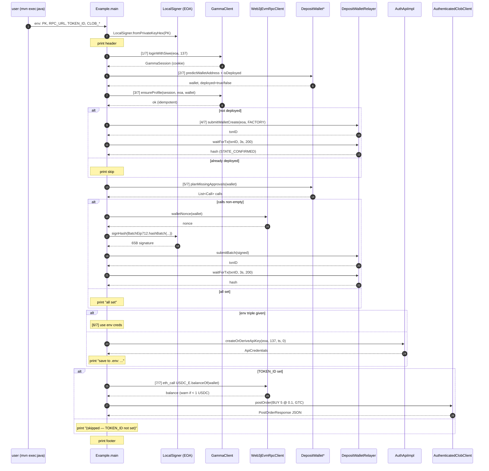

# FullOnboardAndTradeExample 设计方案

> 在 `example/` 包内新增一份**原语级**（primitive-level）端到端 onboard + trade 演示，并把现有 `DepositWalletOnboardAndTradeExample` 重命名为 `OnboarderExample`，让"高层一键流水线"和"逐步原语演示"两种用途各有清晰入口。
>
> **参照对象**：`/Users/bmtaka/Downloads/clob-client-v2/examples/account/fullOnboardAndTrade.ts`（TypeScript SDK 同名 example，用 `viem` + `fetch` 直接驱动每一步）。

---

## 目标

1. **排障可见性**：当生产或冒烟流程在某一步失败时，能用一个**最小、扁平、单文件**的 Java 程序复现到具体步骤，打印对应的链上 `txnID` / `state` / `hash` / 响应 JSON——本质是把 `Onboarder` 的"黑盒一键"拆开来"白盒展示"。
2. **学习样板**：对照 TS 版 `fullOnboardAndTrade.ts`，给 Java SDK 用户一份**抽象层级一致**的参考实现。TS 用 `viem` 原语 + `ClobClient`；Java 用 `Web3jEvmRpcClient` + `DepositWalletDerivation` / `ApprovalPlanner` / `BatchEip712` / `DepositWalletRelayer` + `AuthenticatedClobClient`。
3. **两份 example 分工清晰**：现有 `DepositWalletOnboardAndTradeExample` 只演示"`Onboarder.run()` 一行调用"，重命名为 `OnboarderExample` 强化定位；新文件 `FullOnboardAndTradeExample` 不走 `Onboarder`，逐步显式调用底层组件。

## 范围

**包含**：

- 新文件 `src/main/java/com/polymarket/clob/example/FullOnboardAndTradeExample.java`：单文件、`main(String[])` 入口、私有 static 辅助函数内联，无新主代码 API。
- 现有 `DepositWalletOnboardAndTradeExample.java` → `OnboarderExample.java` 重命名（同包内）。
- `README.md` 4 处文本同步更新（行 94、447、463、479）。
- `CHANGELOG.md` 新增条目（重命名是破坏性改动）。

**不包含**：

- 不新增主代码 API，不修改 `Onboarder` / `OnboardingConfig` / `OnboardingResult`。
- 不新增自动化测试（example 的全部底层逻辑已被现有单测覆盖；新文件只是"组合方式"）。
- 不修改 `pom.xml`（`exec-maven-plugin` 没有硬编码 `mainClass`，jacoco 已 `excludes example/**`）。
- 不修改历史 spec/plan 文档，`docs/superpowers/specs/2026-05-07-deposit-wallet-onboarding-design.md` 等按写作时点保留。

## 架构

`FullOnboardAndTradeExample.java` 单文件内部模块：

```
FullOnboardAndTradeExample
├── main(String[])                     编排：env 解析 + 7 步顺序执行 + try/catch
├── 顶层常量                            RELAYER_HOST / GAMMA_HOST / CHAIN_ID / 测试单参数
├── step(int n, String label)          进度打印（[n/7] label）
├── printSection(String title)         分隔线（═══...═══）
└── parseTickSize(String) → TickSize   "0.01" → 枚举
```

**直接依赖的 SDK 组件**（不经过 `Onboarder`）：

```
EOA Signer (LocalSigner)
   │
   ├─→ GammaClient.loginWithSiwe / ensureProfile        ──→ Gamma (gamma-api.polymarket.com)
   │
   ├─→ Web3jEvmRpcClient                                ──→ Polygon RPC (polygon-rpc.com)
   │       │
   │       └─→ DepositWalletReads
   │              ├─→ DepositWalletDerivation           # 派生地址 / 部署检测
   │              └─→ ApprovalPlanner                   # 缺失 allowance 规划
   │
   ├─→ BatchEip712.hashBatch + Signer.signHash          # 本地：EIP-712 摘要 + 65B 签名
   │
   ├─→ DepositWalletRelayer.submitWalletCreate          ──→ Relayer (relayer-v2.polymarket.com)
   │   DepositWalletRelayer.submitBatch
   │   DepositWalletRelayer.waitForTx
   │
   ├─→ AuthApiImpl.createOrDeriveApiKey                 ──→ CLOB (clob.polymarket.com)
   │
   └─→ AuthenticatedClobClient.postOrder                ──→ CLOB
```

外部依赖与现有 example 一致：Polygon RPC、Gamma、Polymarket Relayer、CLOB——**不引入新外部服务**。

`OnboarderExample.java`（重命名后）保持原 `DepositWalletOnboardAndTradeExample.java` 的实现不变，只改类名 + 文件名。

## 步骤切分

沿用 `Onboarder` javadoc 的 7 步约定（SIWE = Step 1，与 `Onboarder.java` 内部注释对齐）：

| # | stdout 标签（英文） | 主要原语调用 | 关键打印 |
|---|---|---|---|
| 1/7 | `Gamma SIWE login → relayer cookie` | `gamma.loginWithSiwe(eoa, chainId).get()` | `✅ logged in` |
| 2/7 | `Derive deposit wallet address from EOA` | `derivation.predictWalletAddress(...)` + `derivation.isDeployed(wallet)` | `id=0x…`、`wallet=0x…`、`deployed=true/false` |
| 3/7 | `Ensure Gamma profile (idempotent)` | `gamma.ensureProfile(session, eoa, wallet)` | `✅ profile ensured` |
| 4/7 | `Wallet already deployed — skip` 或 `Deploy wallet via WALLET-CREATE` | `relayer.submitWalletCreate(...)` + `relayer.waitForTx(...)` | `txnID=…`、`state=…`、`hash=…` |
| 5/7 | `Check allowances and approve missing` | `planner.planMissingApprovals` → 缺则 `reads.walletNonce` + `BatchEip712.hashBatch` + `eoa.signHash` + `relayer.submitBatch` | `Submitting N approval(s) via WALLET batch...` 或 `All allowances already set ✅` |
| 6/7 | `Get CLOB L2 API credentials` | env 三件套都给 → 直接用；否则 `auth.createOrDeriveApiKey(...)` | `Using existing creds from .env` 或 `Derived new creds. Save to .env to skip ...` |
| 7/7 | `Place test order (token=...)` | `reads.erc20BalanceOf(USDC_E, wallet)` 预检 → `AuthenticatedClobClient.createAndPostLimitOrderV2(...)` | `Deposit wallet USDC.e balance: …`、可选 `⚠️  Wallet has < 1 USDC`、`Response: {json}` |

`TOKEN_ID` 缺省时跳过 step 7：打印 `[7/7] (skipped — TOKEN_ID not set)` 然后 `✅ Onboarding complete`。**保留 `/7` 编号不变**——流程是 7 步，只是最后一步被跳过。

## 流程时序



## 幂等点

每一步在"写"之前先读链上/后端状态，重复跑同一个 `PK` 不会重复部署、重复授权、重复创建凭证：

| 步骤 | 已就绪判定 | 已就绪行为 |
|---|---|---|
| 4/7 部署钱包 | `derivation.isDeployed(wallet) == true` | 打印 `Wallet already deployed — skip` |
| 5/7 授权 batch | `planner.planMissingApprovals(wallet).isEmpty()` | 打印 `All allowances already set ✅` |
| 6/7 API 凭证 | `CLOB_API_KEY` + `CLOB_SECRET` + `CLOB_PASS_PHRASE` 三件套都给 | 打印 `Using existing creds from .env` |
| 7/7 测试单 | `TOKEN_ID` env 缺省 | 打印 `[7/7] (skipped — TOKEN_ID not set)` |

**注**：下单（步骤 7）若不跳过则**不**幂等，每次都会真实提单。但下单参数固定（BUY 5 @ 0.1，约 0.5 USDC），适合开发调试。

## 输入与输出

**调用方式**：

```bash
mvn -q exec:java \
  -Dexec.mainClass=com.polymarket.clob.example.FullOnboardAndTradeExample
```

**环境变量**（完全对齐 TS 版）：

| 变量 | 必填 | 默认值 | 说明 |
|---|---|---|---|
| `PK` | ✅ | — | EOA 私钥 hex（带或不带 `0x` 都接受，由 `LocalSigner.fromPrivateKeyHex` 处理） |
| `RPC_URL` | | `https://polygon-rpc.com` | Polygon RPC |
| `TOKEN_ID` | | — | CLOB token ID（uint256 十进制字符串）；缺省 → 跳过步骤 7 |
| `CLOB_API_URL` | | `https://clob.polymarket.com` | CLOB host |
| `CLOB_API_KEY` + `CLOB_SECRET` + `CLOB_PASS_PHRASE` | | — | 三个全给 → 跳过派生；缺任一 → 派生新凭证并打印 |

**输出**：

- stdout：每步 `[n/7] <label>` 进度行 + 关键字段（`id` / `wallet` / `txnID` / `state` / `hash` / `Response: {json}`）。
- 退出码：成功 = 0；任意步骤抛异常 = 1。

## 顶部常量

文件顶部 `private static final` 常量，与 TS `fullOnboardAndTrade.ts` 顶部 `const` 块一一对应：

| 常量 | 值 |
|---|---|
| `CHAIN_ID` | `137` |
| `RELAYER_HOST` | `URI.create("https://relayer-v2.polymarket.com")` |
| `GAMMA_HOST` | `URI.create("https://gamma-api.polymarket.com")` |
| `DEFAULT_RPC_URL` | `"https://polygon-rpc.com"` |
| `DEFAULT_CLOB_URL` | `"https://clob.polymarket.com"` |
| `RELAYER_POLL_INTERVAL` | `Duration.ofSeconds(3)` |
| `RELAYER_MAX_ATTEMPTS` | `200` |
| `TEST_PRICE` | `BigDecimal("0.1")` |
| `TEST_SIZE` | `BigDecimal("5")` |
| `TEST_SIDE` | `Side.BUY` |
| `TEST_ORDER_TYPE` | `OrderType.GTC` |
| `TEST_TICK_SIZE` | `"0.01"` |
| `TEST_NEG_RISK` | `false` |

## 错误处理

- `main` 签名 `public static void main(String[] args) throws Exception`，**外层 try/catch `Throwable`**：捕获后打印 `\n❌ Test failed: <ex.getMessage()>` + 完整 stacktrace，`System.exit(1)` 退出（对齐 TS `process.exit(1)`）。
- 每步异步操作用 `.get()` 同步阻塞（参照现有 example）。
- Step 5 是唯一嵌套较深的（plan → 若非空则 nonce → digest → sign → submit → wait），按"先 await 再决定下一步"展开成线性 4 行，**不**用 `thenCompose` 链——和 `Onboarder.java` 内部不一样，但 example 的目的就是"线性可读"。
- **USDC.e 余额读取**：直接调用 `DepositWalletReads.erc20BalanceOf(PolymarketContracts.USDC_E, wallet)`——这是已存在的公开方法，无需新增主代码 API 或 example 内联辅助。

## 配套改动

**`pom.xml`**：✅ 零改动（`exec-maven-plugin` 没有硬编码 `mainClass`，jacoco 已 `excludes com/polymarket/clob/example/**`）。

**`README.md`** 4 处更新：

| 行 | 当前内容 | 改成 |
|---|---|---|
| 94 | `完整端到端 + 下单见 …DepositWalletOnboardAndTradeExample.java` | 链接改成 `FullOnboardAndTradeExample.java` |
| 447 | `mvn -q exec:java -Dexec.mainClass=…DepositWalletOnboardAndTradeExample` | 改成 `OnboarderExample`，下方新增一行 `FullOnboardAndTradeExample` |
| 463 | 迁移表 `EndToEndOnboardingExample → DepositWalletOnboardAndTradeExample` | 改成 `→ OnboarderExample` |
| 479 | example 总表 `DepositWalletOnboardAndTradeExample` 一行 | 改成两行：`OnboarderExample`（一键 Onboarder）+ `FullOnboardAndTradeExample`（原语级排障样板） |

**`CHANGELOG.md`**：新增 unreleased 条目，描述：

- `example.DepositWalletOnboardAndTradeExample` 重命名 → `OnboarderExample`（**破坏性**：用 `mvn exec:java -Dexec.mainClass=` 调用的脚本要改）。
- `example.FullOnboardAndTradeExample` 新增。

## 安全性

- **私钥处理**：`PK` 只来自环境变量，**不**支持命令行 args 或文件路径（避免误传到 shell history / git）。
- **API 凭证打印**：派生新凭证时会把 `CLOB_API_KEY` / `CLOB_SECRET` / `CLOB_PASS_PHRASE` 明文打到 stdout（这是 TS 版的行为，目的是让用户复制到 `.env`）。**风险**：在 CI / 远程主机上跑会进日志系统。
  - 缓解：README 注明"本地运行；远程/CI 请预先把三件套放到 env 后跳过派生"。
  - 不做 redaction：失去"派生凭证给你保存"这条核心交付物，且后端对同一 EOA 的派生是幂等的，生产可控。
- **限流 / 熔断**：example 是单次执行，不需要。`relayer.waitForTx` 已经有 `RELAYER_MAX_ATTEMPTS=200` 兜底（≈10 分钟超时）。
- **打印的链上数据**：`txnID` / `hash` / `wallet` / `id` / `PostOrderResponse` 都是公开可查，无敏感性。

## 测试

不新增自动化测试。example 的所有底层逻辑已被现有单测覆盖：

- `OnboarderTest`（WireMock 端到端）
- `DepositWalletDerivationTest` / `DepositWalletReadsTest`
- `ApprovalPlannerTest` / `BatchEip712Test` / `DepositWalletRelayerTest`
- `OrderBuilderPol1271Test` / `Pol1271SignTest` 等

**编译/回归**（开发时必跑）：

| # | 场景 | 验证方式 |
|---|---|---|
| 1 | 编译通过 | `mvn -q -DskipTests compile` |
| 2 | 既有套件不回归 | `mvn -q test`（重命名不影响 main 包以外的 import；既有 80 个测试文件无引用 `DepositWalletOnboardAndTradeExample`） |

**真链冒烟**（用户在交付后手动跑）：

| # | 场景 | 关键验证点 |
|---|---|---|
| 3 | onboard-only 冷启动（干净 EOA，不设 `TOKEN_ID`） | 6 步全跑、步骤 7 跳过；EOA 链上 1 笔部署交易 + 1 笔 batch（含最多 13 笔 inner approval calls） |
| 4 | onboard-only 重入（同 EOA 再跑一次） | 步骤 4 / 5 都打印 skip；**无**新链上交易；步骤 6 后端幂等返回同一组凭证 |
| 5 | 完整 onboard + trade | EOA 已 onboard、deposit wallet ≥ 1 USDC.e、env 全给：7 步全跑，stdout 末尾打印 `Response: {orderID: ..., status: ...}` |
| 6 | env triple 缓存 | 设置 `CLOB_API_KEY/SECRET/PASS_PHRASE`：步骤 6 打印 `Using existing creds from .env`，**无** L1 签名 / `/auth/api-key` 调用 |
| 7 | 缺 `PK` 报错 | 立即抛 `IllegalStateException("set PK env var (EOA private key)")`，退出码 = 1 |
| 8 | 步骤异常退出码 | 故意给错的 `RPC_URL`：步骤 2 抛异常，stderr 打印 stacktrace，`echo $?` = 1 |
| 9 | `OnboarderExample` 仍可运行 | `mvn -q exec:java -Dexec.mainClass=…OnboarderExample` 行为与重命名前一致 |

## 排期

| 任务 | 工作量（人天） |
|---|---|
| T1：重命名 `DepositWalletOnboardAndTradeExample` → `OnboarderExample`（移动文件 + 改类名 + 仓内零引用确认） | 0.1 |
| T2：新增 `FullOnboardAndTradeExample.java`（≈ 250 行单文件） | 0.5 |
| T3：`README.md` 4 处文本更新 + `CHANGELOG.md` 一条 unreleased 条目 | 0.1 |
| T4：`mvn -q compile` + `mvn -q test` 回归 | 0.1 |
| **合计（开发）** | **0.8** |

依赖：T2 不依赖 T1（两个文件独立）；T3 应在 T1/T2 完成后执行。T5（用户冒烟，0.5 人天）不在交付范围内。
